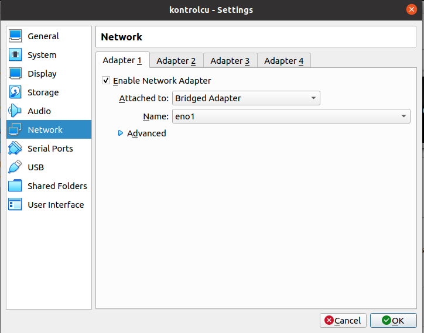
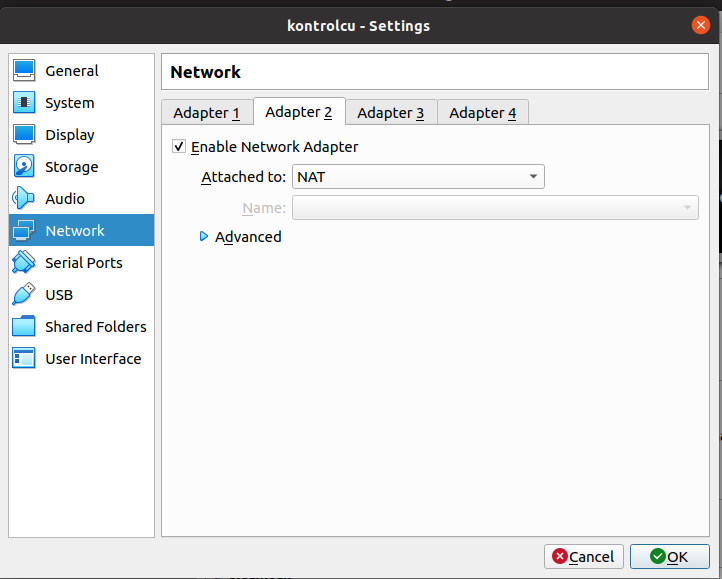
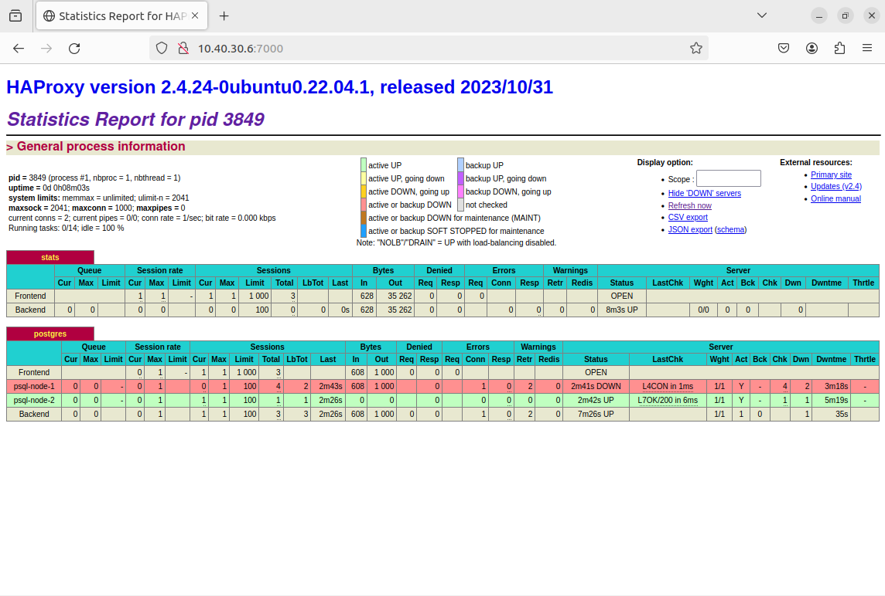

# Kurulum Nasıl Yapılır
İlk olarak 3 tane ubuntu cihaz gerekiyor. Cihazlardan birisi **kontrolcu** diğerleri de **node-1** ve **node-2**. **node-1** ve **node-2**'de _patroni_ ve _postgresql_ kurulu olacak, **kontrolcu**'de de _etcd_ ve _haproxy_. Ben sanal cihazları oluşturmak için _virtalbox_ kullandım. 
* Tüm cihazlarda internet, _Adapter 1_ için **Bridged**, _Adapter 2_ içinse **NAT** olarak ayarlanmalı. [_Adapter 1_](#Adapter_1) cihazların kendi aralarında haberleşmesi için, [_Adapter 2_](#Adapter_2)'yse internete bağlanmak için.  


<p align="center"><span id="Adapter_1">Adapter 1 Ayarları</span></p>




<p align="center"><span id="Adapter_2">Adapter 2 Ayarları</span></p>





* Sonrasında sırasıyla;

    * kontrolcu için
        ```sh
        bash kontrolcu_sunucu_kur.sh
        ``` 
    * node-1 için
        ```sh
        bash sql_kur.sh node-1
        ``` 
    * node-2 için
        ```sh
        bash sql_kur.sh node-2
        ```
    dosyaları çalıştırılır ve bu şekilde kurulum tamamlanmış olur
* Sonrasında servisleri ayağa kaldırmak için node-1 ve node-2'den 
    ```sh
    sudo systemctl daemon-reload
    sudo systemctl enable patroni 
    sudo systemctl enable postgresql
    sudo systemctl start patroni
    sudo systemctl start postgresql
    ```
    komutları çalıştırılabilir. kontrolcu içinse 
    ```sh
    sudo systemctl restart etcd
    sudo systemctl start haproxy
    sudo systemctl enable haproxy
    sudo systemctl restart haproxy
    ```
    komutları çalıştırılabilir. Her bir servis aynı zamanda 
    ```sh
    sudo systemctl status servis_adi
    sudo systemctl stop servis_adi
    sudo systemctl enable servis_adi
    sudo systemctl start servis_adi
    sudo systemctl restart servis_adi
    ```
    komutlarıyla izlenip yönetilebilir.
* Bundan sonra sistem durumunu kontrol etmek için node-1 ve node-2'den
    ```sh 
    sudo patronictl -c /etc/patroni.yml list
    ```
    komutu çalıştırılabilir. Bu komut patronilerin hangisinin replica hangisinin lider olduğunu vs. gösterir. Üç cihazdan herhangi birinde tarayıcı açarak ve _varsayilan_degiskenler.sh_ dosyasındaki _VARSAYILAN_ETCD_IP_ADRESI_ ve _HAPROXY_BIND_PORT_  değerlerini kullanarak VARSAYILAN_ETCD_IP_ADRESI:HAPROXY_BIND_PORT (örneğin 10.40.30.6:7000) [cihazların durumunu izleyebilirsiniz](#proxy_port).

<p align="center"><span id="proxy_port">Cihaz Durumu İzleme</span></p>




* Artık veri tabanına 
    ```sh
    sudo su - 
    psql -h VARSAYILAN_ETCD_IP_ADRESI -p 5000 -U postgres -W
    ```
    komutuyla bağlanabilirsiniz.